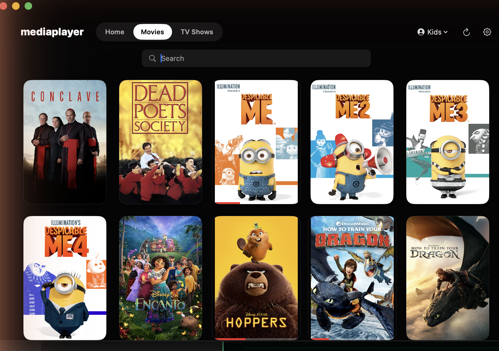

# mediaplayer

An open-source media player for **macOS, iOS and tvOS** — a
beautiful native front-end for your Plex or Jellyfin server (and plain SMB
shares) with hardware-decoded 4K HDR playback. A Windows port is being
explored (see [TODO.md](TODO.md)).



## Features

**Playback** — built on [MPVKit](https://github.com/mpvkit/MPVKit) (libmpv, LGPL build)
- Hardware decoding via VideoToolbox, `gpu-next` rendering through Vulkan/MoltenVK
- 4K HDR10 / Dolby Vision tone-mapping tuned out of the box
- Skip Intro / Skip Ads / Next Episode from Plex markers — button or fully automatic
- Next-episode autoplay, resume positions, per-user watch state
- External subtitles managed by Plex (sidecar files and OpenSubtitles agent
  downloads) load automatically, with preferred-language auto-select
- Track pickers, subtitle scale/sync, audio sync, speed, volume boost

**Library**
- Sign in with Plex (PIN flow) — that's the whole onboarding
- Plex Home profiles with genuinely separate watch histories; restricted
  (Kids) profiles enforced server-side
- Server-driven Continue Watching, ratings, watched toggles
- Rotating hero of recent movies and shows — swipe, trackpad-scroll, or dots
- Streaming-service style detail pages: full backdrops, season pills,
  episode stills with synopses and progress
- Direct SMB browsing, and a TMDB-enriched local library when Plex isn't around
- Settings: General / Files / Playback / Audio / Languages (skip lengths,
  auto intro skip, channel layout, Dolby passthrough, preferred languages)

**Design** — true-black monochrome UI, red reserved for progress bars.

## Architecture

```
apps/macos     SwiftUI app (the UI is shared by all three platforms)
apps/ios       iOS + tvOS targets (XcodeGen, reuse the macOS sources)
core/mediacore Rust engine: SMB client, loopback HTTP streamer with Range
               support, SQLite index, Plex + TMDB clients (axum, smb-rs,
               rusqlite, reqwest) — UniFFI bridge on iOS/tvOS,
               helper daemon on macOS
```

The engine exposes everything (library, streams, Plex auth/users/markers/
subtitles) as a localhost HTTP API the apps consume; mpv streams from it
with plain Range requests.

## Building

```sh
# macOS app bundle
./scripts/bundle-macos.sh          # → apps/macos/.build/MediaPlayer.app

# Rust xcframework for iOS/tvOS, then the Xcode projects
./scripts/build-xcframework.sh
cd apps/ios && xcodegen generate
xcodebuild -project MediaPlayeriOS.xcodeproj -scheme MediaPlayeriOS build
```

Requires Xcode 15+, Rust (with the Apple targets), and XcodeGen.

## Roadmap

- Jellyfin & Emby sources
- Offline downloads
- Real-device deployment + TestFlight
- tvOS remote polish

## License

This repository's code is licensed under the **Mozilla Public License 2.0**
— see [LICENSE](LICENSE). File-level copyleft: changes to these files must be
published, but MPL imposes no App Store-incompatible restrictions, and it
doesn't reach into code you add alongside it.

Playback links MPVKit's **LGPL** build of mpv/FFmpeg (the `MPVKit` product,
not `MPVKit-GPL`), which keeps App Store distribution viable. See MPVKit for
its own licenses.

Contributions are accepted under the same license — see
[CONTRIBUTING.md](CONTRIBUTING.md).
